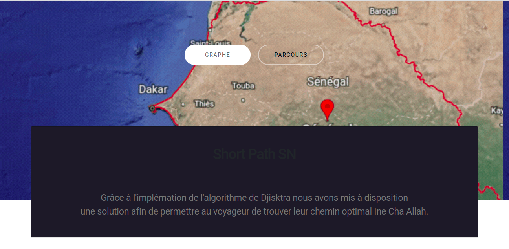
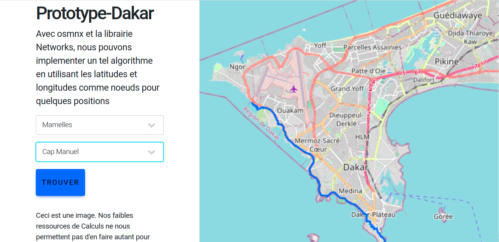

# Dijskstra_WebAPP
Implémentation de l'algorithme de Dijsktra pour trouver le plus court chemin entre deux villes du Sénégal. Application réalisée avec Flask
L'appication est disponible à l'adresse https://ousmanedia.pythonanywhere.com/ jusqu'au Dimanche 19 Mars 2023 Ine Cha ALLAH.<br>

Pour exécuter en local:
# A* Shortest Path Dijstra Algorithm

## Requirements
* Python 3.8.8
* Flask 1.1.2

## Installation
```
pip install flask
export FLASK_APP=app.py
```
## Running
```
cd /path/to/repo
flask run
```




